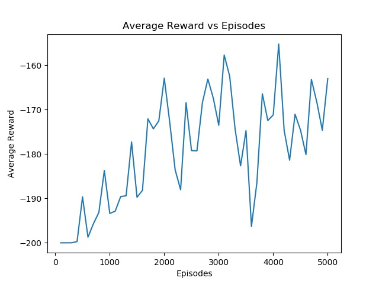

# Reinforcement-Learning-Introduction

## Test Environment
#### Introduction
- Name : MountainCar-v0
- Goal : Get an under powered car to the top of a hill (top = 0.5 position)

#### Observation
Type: Box(2)
|  Num  |      Observation     | Min | Max |
|----------|:-------------:|------:|------:|
| 0 | position | -1.2 | 0.6|
| 1 |  velocity | -0.07 | 0.07|

#### Actions
Type: Discrete(3)
| Num | Action |
|------|:------:|
| 0 | push left |
| 1 | no push |
| 2 | push right |

#### Reward
-1 for each time step, until the goal position of 0.5 is reached. As with MountainCarContinuous v0, there is no penalty for climbing the left hill, which upon reached acts as a wall.

## Different Methods
- Random Action : [random_action.py](https://github.com/TzuYuOu/Reinforcement-Learning-Introduction/blob/master/random_action.py)
- Hand-Made Policy : [hand_made_policy.py](https://github.com/TzuYuOu/Reinforcement-Learning-Introduction/blob/master/hand_made_policy.py)
- Q-Learning : [q_learning.py](https://github.com/TzuYuOu/Reinforcement-Learning-Introduction/blob/master/q_learning.py)
    - reward and episodes
    

- Deep-Q-Learning

## Reference
- [MountainCar v0](https://github.com/openai/gym/wiki/MountainCar-v0)
- [gkhayes/Mountain_Car.py](https://gist.github.com/gkhayes/3d154e0505e31d6367be22ed3da2e955)
- [Reinforcement Learning 健身房：OpenAI Gym](https://medium.com/pyladies-taiwan/reinforcement-learning-%E5%81%A5%E8%BA%AB%E6%88%BF-openai-gym-e2ad99311efc)

